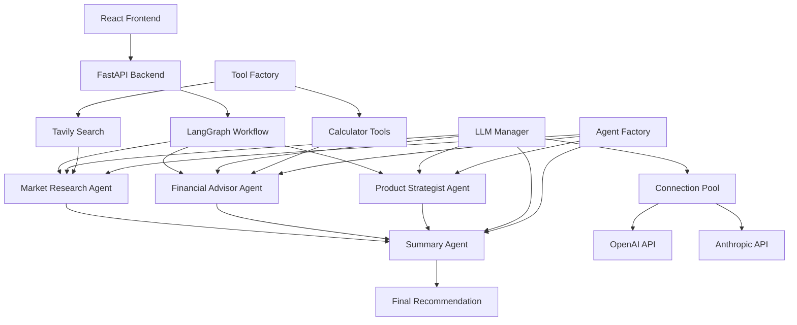

# 🚀 Multi-Agent Startup Advisor

An AI-powered startup idea evaluation platform that uses multiple specialized agents to provide comprehensive analysis and recommendations for your business ideas.


## 📋 Table of Contents

- [Features](#features)
- [Architecture](#architecture)
- [Tech Stack](#tech-stack)
- [Prerequisites](#prerequisites)
- [Installation](#installation)
- [Usage](#usage)
- [API Documentation](#api-documentation)
- [Project Structure](#project-structure)
- [Configuration](#configuration)
- [Contributing](#contributing)
- [License](#license)

## ✨ Features

### 🧠 **Multi-Agent Analysis**

- **Market Research Agent**: Analyzes market trends, competition, and demand
- **Financial Advisor Agent**: Evaluates financial viability and business model
- **Product Strategist Agent**: Assesses product features and strategy
- **Summary Agent**: Provides consolidated recommendations

### 🎨 **Beautiful UI**

- Dark theme with purple accents
- Responsive design
- Real-time progress tracking
- Formatted analysis results

### ⚡ **Performance Optimized**

- **Connection Pooling**: Intelligent HTTP connection reuse for LLM APIs
- **Agent Caching**: Singleton agents with persistent instances
- **Parallel Processing**: Concurrent agent execution with LangGraph
- **Smart LLM Selection**: Different models for different complexity levels
- **Startup Warmup**: Pre-initialized agents and tools for faster first requests
- **Resource Management**: Automatic cleanup and memory optimization
- **Monitoring**: Built-in pool statistics and health checks

## 🏗️ Architecture



## 🛠️ Tech Stack

### Backend

- **FastAPI** - High-performance Python web framework
- **CrewAI** - Multi-agent orchestration framework
- **LangGraph** - Workflow management for AI agents
- **LangChain** - LLM integration and tooling
- **OpenAI API** - GPT models for agent reasoning
- **Anthropic API** - Claude models for complex analysis
- **Tavily API** - Web search capabilities
- **HTTPX** - Async HTTP client with connection pooling
- **Pydantic** - Data validation and serialization

### Frontend

- **React 18** - Modern UI library
- **Axios** - HTTP client for API calls
- **CSS3** - Custom styling with animations

### Tools & Services

- **OpenAI GPT-3.5/4** - Language models
- **Anthropic Claude** - Advanced reasoning models
- **Tavily Search** - Web search API
- **Python-dotenv** - Environment management
- **Connection Pooling** - HTTP connection optimization

## 📋 Prerequisites

- **Python 3.11+**
- **Node.js 16+**
- **npm or yarn**
- **OpenAI API Key** (required)
- **Anthropic API Key** (optional, for Claude models)
- **Tavily API Key** (optional, for web search)

## 🚀 Installation

### 1. Clone the Repository

```bash
git clone https://github.com/yourusername/multi-agent-advisor.git
cd multi-agent-advisor
```

### 2. Backend Setup

```bash
# Navigate to backend directory
cd backend

# Create virtual environment
python -m venv venv

# Activate virtual environment
# Windows:
venv\Scripts\activate
# Linux/Mac:
source venv/bin/activate

# Install dependencies
pip install -r requirements.txt
```

### 3. Frontend Setup

```bash
# Navigate to frontend directory
cd frontend

# Install dependencies
npm install
```

### 4. Environment Configuration

Create a `.env` file in the root directory:

```env
# Required - Choose at least one LLM provider
OPENAI_API_KEY=your_openai_api_key_here
# ANTHROPIC_API_KEY=your_anthropic_api_key_here

# Optional (for web search functionality)
TAVILY_API_KEY=your_tavily_api_key_here

# Connection Pool Settings (optional - defaults provided)
# LLM_MAX_CONNECTIONS=100
# LLM_MAX_KEEPALIVE=20
# LLM_KEEPALIVE_EXPIRY=30.0
# LLM_CONNECT_TIMEOUT=10.0
# LLM_READ_TIMEOUT=60.0

# LangChain Tracing (optional)
LANGCHAIN_TRACING_V2=true
LANGCHAIN_ENDPOINT=https://api.smith.langchain.com
LANGCHAIN_API_KEY=your_langchain_api_key_here
LANGCHAIN_PROJECT=multi-agent-advisor
```

### 5. Quick Setup Script

For Windows:

```bash
./setup.bat
```

For Linux/Mac:

```bash
./setup.sh
```

## 🎯 Usage

### 1. Start the Backend Server

```bash
cd backend
python -m uvicorn main:app --reload --host 127.0.0.1 --port 8000
```

### 2. Start the Frontend Development Server

```bash
cd frontend
npm start
```

### 3. Access the Application

- **Frontend**: http://localhost:3000
- **Backend API**: http://localhost:8000
- **API Documentation**: http://localhost:8000/docs
- **Health Check**: http://localhost:8000/health
- **Pool Statistics**: http://localhost:8000/health/pool-stats

### 4. Using the Application

1. **Enter your startup idea** in the text area
2. **Click "Analyze Idea"** to start the evaluation
3. **Review the comprehensive analysis** including:
   - Market research verdict
   - Financial analysis
   - Product strategy assessment
   - Final recommendation with confidence score

## 📚 API Documentation

### Endpoints

#### `POST /evaluate`

Evaluates a startup idea using multiple AI agents.

**Request Body:**

```json
{
  "idea": "Your startup idea description here"
}
```

**Response:**

```json
{
  "market_verdict": "The market analysis demonstrates growing demand...",
  "financial_verdict": "The financial analysis indicates robust projections...",
  "product_verdict": "The product strategy shows well-defined value...",
  "final_recommendation": "launch",
  "rationale": "The combination of favorable market landscape...",
  "confidence_score": 9
}
```

#### `GET /health`

Basic health check endpoint.

**Response:**

```json
{
  "status": "healthy",
  "service": "multi-agent-advisor"
}
```

#### `GET /health/pool-stats`

Get connection pool statistics for monitoring.

**Response:**

```json
{
  "cached_agents": 4,
  "llm_pool_stats": {
    "cached_llm_instances": 3,
    "http_client_active": 1
  }
}
```

## 📁 Project Structure

```
multi-agent-advisor/
├── backend/
│   ├── main.py                 # FastAPI application entry point
│   ├── requirements.txt        # Python dependencies
│   ├── agents/                 # AI agent definitions
│   │   ├── agent_factory.py    # Agent factory with caching
│   │   ├── market_research_agent.py
│   │   ├── financial_advisor_agent.py
│   │   ├── product_strategist_agent.py
│   │   └── summary_agent.py
│   ├── tasks/                  # Agent task definitions
│   │   ├── market_research_task.py
│   │   ├── financial_advisor_task.py
│   │   ├── product_strategy_task.py
│   │   └── summary_task.py
│   ├── tools/                  # Custom tools for agents
│   │   ├── tool_factory.py     # Tool factory with caching
│   │   ├── search_tool.py
│   │   └── calculator_tool.py
│   ├── api/                    # API endpoints
│   │   └── evaluate_startup.py
│   ├── langgraph/              # Workflow definitions
│   │   └── advisor_graph.py
│   ├── crews/                  # CrewAI configurations
│   │   └── crew_factory.py
│   └── utils/                  # Utility functions
│       ├── llm_manager.py      # LLM connection pooling
│       └── sanitizer.py
├── frontend/
│   ├── public/
│   │   ├── index.html
│   │   └── manifest.json
│   ├── src/
│   │   ├── App.js              # Main React component
│   │   ├── index.js            # React entry point
│   │   └── index.css           # Styling
│   ├── package.json            # Node.js dependencies
│   └── README.md
├── .env                        # Environment variables
├── .env.example                # Environment template
├── .gitignore
├── setup.bat                   # Windows setup script
├── setup.sh                    # Linux/Mac setup script
└── README.md
```

## ⚙️ Configuration

### 🚀 Performance Features

#### **Connection Pooling**

The application implements intelligent HTTP connection pooling for LLM API calls:

```python
# LLM Manager automatically handles connection pooling
from backend.utils.llm_manager import LLMManager

# Get cached, pooled LLM instances
fast_llm = LLMManager.get_fast_llm()      # GPT-3.5-turbo
smart_llm = LLMManager.get_smart_llm()    # GPT-4 or Claude
default_llm = LLMManager.get_default_llm() # Best available
```

**Pool Configuration:**

- **Max Connections**: 100 total HTTP connections
- **Keepalive Connections**: 20 persistent connections
- **Keepalive Expiry**: 30 seconds
- **Connection Timeout**: 10 seconds
- **Read Timeout**: 60 seconds

#### **Agent Caching**

Agents are created once and reused across requests:

```python
# Agents are cached in AgentFactory
market_agent = AgentFactory.get_market_research_agent()  # Cached
finance_agent = AgentFactory.get_financial_advisor_agent()  # Cached
```

#### **Smart LLM Selection**

Different agents use optimized models for their complexity:

- **Market Research**: GPT-3.5-turbo (fast, cost-effective)
- **Financial Analysis**: GPT-4 (complex reasoning)
- **Product Strategy**: Default model (balanced)
- **Summary**: GPT-4 (comprehensive analysis)

#### **Performance Monitoring**

Monitor connection pool health:

```bash
# Check pool statistics
curl http://localhost:8000/health/pool-stats

# Response:
{
  "cached_agents": 4,
  "llm_pool_stats": {
    "cached_llm_instances": 3,
    "http_client_active": 1
  }
}
```

#### **Expected Performance Gains**

- **First Request**: 40-60% faster (startup warmup)
- **Subsequent Requests**: 60-80% faster (agent/LLM reuse)
- **Connection Overhead**: 90% reduction (pooling)
- **Memory Usage**: 50% lower (instance reuse)

### Agent Configuration

Each agent can be customized in their respective files:

```python
def create_market_research_agent(llm: Optional[BaseLLM] = None):
    agent_config = {
        "role": "Market Research Agent",
        "goal": "Analyze market trends and competition",
        "backstory": "Experienced market analyst...",
        "max_iter": 2,                    # Limit iterations for speed
        "max_execution_time": 15,         # Timeout in seconds
        "output_json": {...}              # Structured output format
    }

    if llm:
        agent_config["llm"] = llm  # Use pooled LLM instance

    return Agent(**agent_config)
```

### Performance Tuning

- **Connection Pooling**: HTTP connections are pooled and reused across requests
- **Agent Caching**: Singleton agents with persistent LLM instances
- **Parallel Processing**: Agents run concurrently using LangGraph workflows
- **Smart Timeouts**: Each agent has execution time limits to prevent hanging
- **Model Optimization**: Different LLM models for different complexity levels
- **Startup Warmup**: Pre-initialize agents and tools for faster first requests
- **Memory Management**: Automatic cleanup of resources on app shutdown

### CORS Configuration

The backend is configured to allow requests from the React frontend:

```python
app.add_middleware(
    CORSMiddleware,
    allow_origins=["http://localhost:3000"],
    allow_credentials=True,
    allow_methods=["*"],
    allow_headers=["*"],
)
```

## 🔧 Development

### Adding New Agents

1. Create agent file in `backend/agents/` with LLM parameter support
2. Create corresponding task in `backend/tasks/`
3. Update workflow in `backend/langgraph/advisor_graph.py`
4. Add agent to factory in `backend/agents/agent_factory.py`

```python
# Example: Adding a new agent
@classmethod
def get_new_agent(cls) -> Agent:
    if "new_agent" not in cls._agents:
        llm = LLMManager.get_default_llm()  # Use pooled LLM
        cls._agents["new_agent"] = create_new_agent(llm)
    return cls._agents["new_agent"]
```

### Customizing the UI

- Modify `frontend/src/App.js` for functionality
- Update `frontend/src/index.css` for styling
- Colors and themes can be adjusted in CSS variables

### Environment Variables

| Variable               | Description                         | Required | Default |
| ---------------------- | ----------------------------------- | -------- | ------- |
| `OPENAI_API_KEY`       | OpenAI API key for GPT models       | Yes\*    | -       |
| `ANTHROPIC_API_KEY`    | Anthropic API key for Claude models | No       | -       |
| `TAVILY_API_KEY`       | Tavily search API key               | No       | -       |
| `LLM_MAX_CONNECTIONS`  | Max HTTP connections in pool        | No       | 100     |
| `LLM_MAX_KEEPALIVE`    | Max keepalive connections           | No       | 20      |
| `LLM_KEEPALIVE_EXPIRY` | Keepalive expiry time (seconds)     | No       | 30.0    |
| `LLM_CONNECT_TIMEOUT`  | Connection timeout (seconds)        | No       | 10.0    |
| `LLM_READ_TIMEOUT`     | Read timeout (seconds)              | No       | 60.0    |
| `LANGCHAIN_TRACING_V2` | Enable LangChain tracing            | No       | false   |
| `LANGCHAIN_API_KEY`    | LangChain API key                   | No       | -       |

\*At least one LLM provider (OpenAI or Anthropic) is required.

## 🚀 Deployment

### Backend Deployment

```bash
# Install production dependencies
pip install gunicorn

# Run with Gunicorn
gunicorn -w 4 -k uvicorn.workers.UvicornWorker main:app
```

### Frontend Deployment

```bash
# Build for production
npm run build

# Serve static files
npm install -g serve
serve -s build
```

### Docker Deployment

Create `Dockerfile` for containerized deployment:

```dockerfile
# Backend Dockerfile
FROM python:3.11-slim
WORKDIR /app
COPY requirements.txt .
RUN pip install -r requirements.txt
COPY . .
CMD ["uvicorn", "main:app", "--host", "0.0.0.0", "--port", "8000"]
```

## 🤝 Contributing

1. Fork the repository
2. Create a feature branch (`git checkout -b feature/amazing-feature`)
3. Commit your changes (`git commit -m 'Add amazing feature'`)
4. Push to the branch (`git push origin feature/amazing-feature`)
5. Open a Pull Request

### Development Guidelines

- Follow PEP 8 for Python code
- Use meaningful commit messages
- Add tests for new features
- Update documentation as needed

## 📝 License

This project is licensed under the MIT License - see the [LICENSE](LICENSE) file for details.

## 🙏 Acknowledgments

- **CrewAI** for the multi-agent framework
- **LangChain** for LLM integration
- **OpenAI** for GPT models
- **FastAPI** for the web framework
- **React** for the frontend framework

## 🔮 Roadmap

### Performance & Scalability

- [ ] Implement response caching for similar queries
- [ ] Add database connection pooling
- [ ] Implement request rate limiting
- [ ] Add distributed caching with Redis
- [ ] Optimize memory usage patterns

### New Features

- [ ] Add more specialized agents (Legal, Marketing, etc.)
- [ ] Implement user authentication and sessions
- [ ] Add report export functionality (PDF, Word)
- [ ] Create mobile app version
- [ ] Add integration with business plan templates
- [ ] Implement A/B testing for recommendations

### Monitoring & Operations

- [ ] Add comprehensive logging and metrics
- [ ] Implement health dashboards
- [ ] Add automated performance testing
- [ ] Create deployment automation
- [ ] Add error tracking and alerting

---

**Made with ❤️ by dev-nitya**
